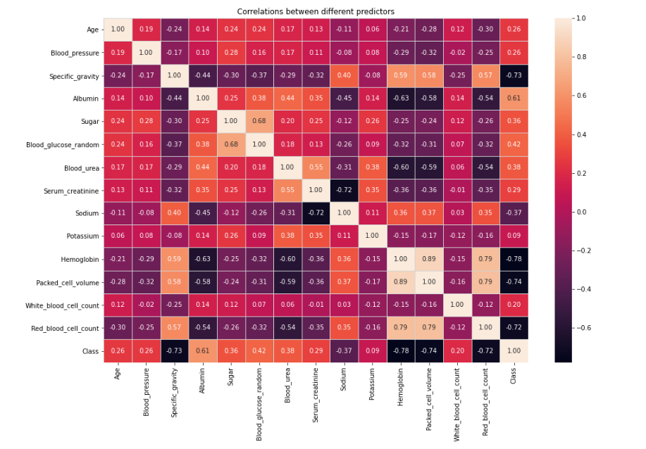

# Chronic Kidney Diseases Prediction

## Overview

* The project involves analyzing some of the major features and its contribution in causing Chronic Kidney diseases

* Have performed various EDA's on the data such as checking for outliers, correlations etc

* Different machine learning models such as Logistic Regression, DecisionTreeClassifier, KNN, Random Forest, and Xgboost are used in training the model and the comparision is listed

* The models are presented with performance metrics like Accuracy, Confusion matrix, Precision, Recall and F1 Score, as both the target classes ( Class 0 and 1) are important in prediction

## Some Exploratory Data Analysis

Preliminary Analysis 

### Similar analysis are done with other features as well

### Best model is given by comparision

